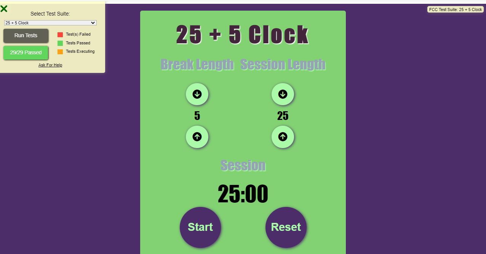

# 25 + 5 Clock
This is the fifth & final challenge of the FreeCodeCamp Front End Development Libraries course.

## Table of contents

- [Overview](#overview)
  - [The challenge](#the-challenge)
  - [Screenshot](#screenshot)
  - [Links](#links)
- [My process](#my-process)
  - [Built with](#built-with)
- [Author](#author)

## Overview

### The challenge

Users should be able to:

- Increase and Decrease the session and break times (min time is 1 min and max is 60 mins)
- Clock should count down backwards on start click
- Users should be able to pause and play time but not increase or decrease if time is running
- Users should be able to restart clcok and  everything is reset

### Screenshot

### Links

- Github Solution: [https://github.com/BiancaNiemann/25-5_Clock](https://github.com/BiancaNiemann/25-5_Clock).
- Live Site [https://25-5-clock-ten-henna.vercel.app/](https://25-5-clock-ten-henna.vercel.app/)

## My process

### Built with

- Semantic HTML5 markup
- CSS
- React

## Author

- Website - [Bianca Niemann](https://portfolio-seven-sepia-13.vercel.app/)
- Frontend Mentor - [@BiancaNiemann](https://www.frontendmentor.io/profile/BiancaNiemann)
- LinkedIn - [@BiancaNiemann](https://www.linkedin.com/in/bianca-niemann-8671b1246/)